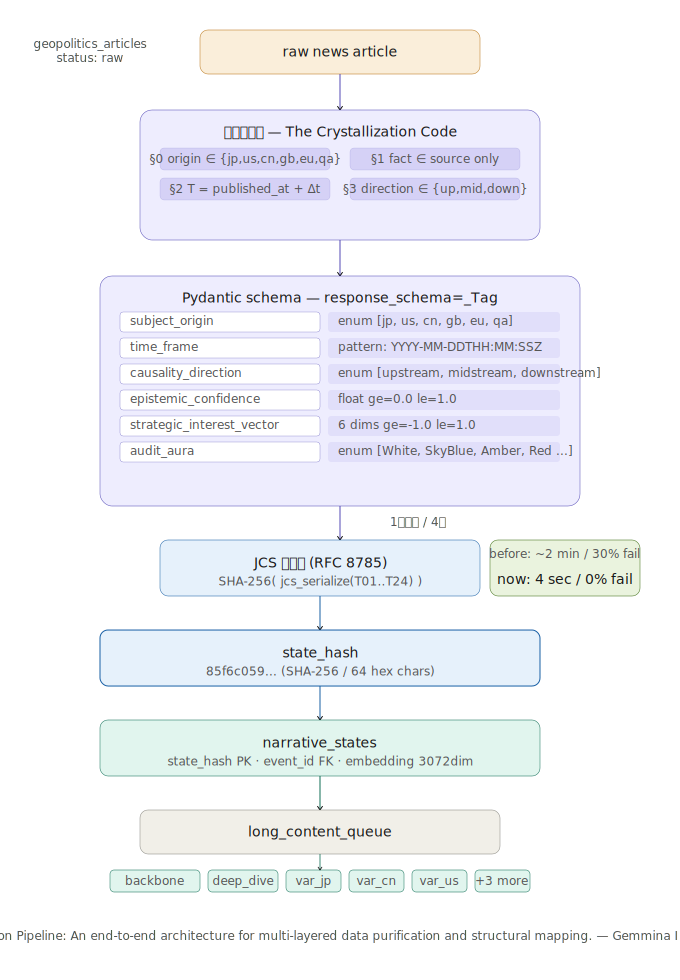
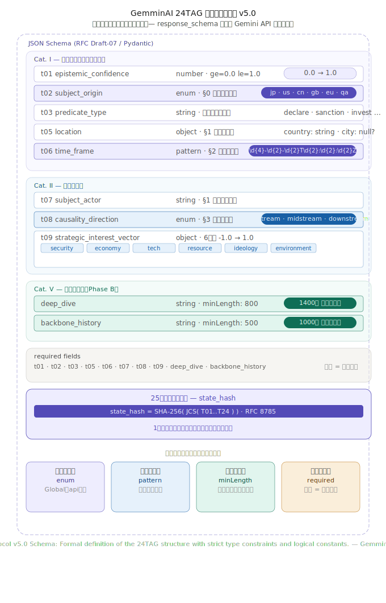

# Narrative Crystallization: A Deterministic Framework for Measuring Global Narrative States

**Author**: Tomohiko Nakamura — Independent Researcher, Japan · tomohiko@gemminai.com  
**Date**: March 2026  
**Protocol**: AIIE Protocol v5.0 · Gemmina Intelligence LLC.  
**Repository**: [GemminAI/Acta-AIIE](https://github.com/GemminAI/Acta-AIIE)

---

## Abstract

Human societies interpret events primarily through narrative structures rather than isolated data points. This paper proposes **Narrative Quantification**, a framework for transforming narrative information into structured cognitive data. By decomposing narratives into actors, events, conflicts, resolutions, emotional context, and causal relationships, narratives can be stored as structured datasets and analyzed computationally.

To operationalize this transformation, the paper introduces the concept of a **Narrative Compiler**, a system that converts narrative text into structured cognitive representations such as the **24TAG structure**. These representations enable the creation of narrative databases that may serve as the foundation for **Large Cognitive Models (LCM)** — systems designed to reason over structured representations of human narratives rather than purely probabilistic language tokens.

This work suggests that narrative quantification may function as a new layer of cognitive infrastructure for future AI systems.

This framework introduces a measurement layer for global narratives, enabling the construction of a time-evolving narrative state space.

---

## Figure 1 — The Narrative Crystallization Pipeline

> *"The Narrative Crystallization Pipeline: A deterministic measurement process that converts raw OSINT narratives into time-indexed narrative state observations."*

[](gemminai_crystallization_pipeline.svg)

**Insertion**: Section 4 "The Narrative Compiler"

The pipeline transforms raw OSINT narratives into deterministic narrative states through a sequence of validation and normalization steps:

1. **Raw narrative ingestion** — news articles and OSINT sources
2. **Constitutional constraint injection** — §0–§3 injected as prompt preamble
3. **Schema-constrained generation** — `response_schema=_Tag` (Pydantic) enforced at API level
4. **Schema validation** — enum, pattern, range, minLength checks
5. **Canonicalization** — RFC 8785 JSON Canonicalization Scheme
6. **Cryptographic state hashing** — `state_hash = SHA-256( JCS( T01..T24 ) )`

**Key metrics**:

| Metric | Before (REST + ResponseGuard) | After (SDK + Pydantic) |
|---|---|---|
| Processing time | ~2 min / article | **~4 sec / article** |
| Schema violation rate | ~30% | **0%** |
| JSON parse errors | Frequent | **Physically impossible** |
| Corpus | 64 articles | **64 / 64 crystallized** |

---

## Figure 2 — AIIE Protocol v5.0 JSON Schema

> *"AIIE Protocol v5.0 JSON Schema: Formal specification for deterministic narrative states with regex-based temporal anchoring and categorical enums."*

[](gemminai_24tag_schema_v5.svg)

**Insertion**: Section 5 "The 24TAG Taxonomy"

Unlike a descriptive annotation guideline, this schema is directly injected into the LLM generation process as `response_schema`, meaning that invalid outputs are rejected at the API level.

**Enforcement pillars**:

| Mechanism | Target fields | Effect |
|---|---|---|
| `enum` | T02 `subject_origin`, T08 `causality_direction` | Rejects "Global", "complex correlation" at API level |
| `pattern` | T06 `time_frame` | Enforces `^\d{4}-\d{2}-\d{2}T\d{2}:\d{2}:\d{2}Z$` — no timezone drift |
| `ge` / `le` | T01 `epistemic_confidence`, T09 SIV (6 dims) | Clamps to valid numeric range |
| `minLength` | `deep_dive` (800), `backbone_history` (500) | Prevents lazy short-form output |
| `required` | All primary TAGs | Incomplete output = re-generation triggered |

---

## The Crystallization Constitution (§0–§3)

Injected as the preamble of `TAG_GENERATION_PROMPT` to constrain Gemini from "reasoning engine" to "strict compiler":

```
§0  subject_origin ∈ {jp, us, cn, gb, eu, qa}
    Determined by narrative perspective, not language. GLOBAL is forbidden.

§1  Fact ∈ Source
    No entity (person, place, value) may be generated beyond what the source
    explicitly states. Unknown location → city = null. Inference = forgery.

§2  T = published_at + Δt
    time_frame must be ISO 8601 UTC/Z (19 chars).
    Vague terms ("today", "recently") are forbidden.

§3  Direction ∈ {upstream, midstream, downstream}
    causality_direction is a 3-choice enum only.
    "Complex correlation" is not an answer.
```

---

## state_hash — The 25th Constant

```
state_hash = SHA-256( JCS( T01 .. T24 ) )
```

Computed via RFC 8785 (JSON Canonicalization Scheme) immediately before DB write.  
Any single-bit tampering produces a detectably different hash — the tamper-evident fingerprint of each narrative crystal.

> "A narrative crystal represents a discrete observation of the global narrative field at time *t*.  
> The evolution of these crystals defines a narrative state transition process."

---

## LaTeX Reference

```latex
% Figure 1 — Section 4
\begin{figure}[t]
\centering
\includegraphics[width=\textwidth]{gemminai_crystallization_pipeline.pdf}
\caption{The Narrative Crystallization Pipeline: A deterministic measurement process
that converts raw OSINT narratives into time-indexed narrative state observations.}
\label{fig:pipeline}
\end{figure}

% Figure 2 — Section 5
\begin{figure}[h]
\centering
\includegraphics[width=\textwidth]{gemminai_24tag_schema_v5.pdf}
\caption{AIIE Protocol v5.0 JSON Schema: Formal specification for deterministic
narrative states with regex-based temporal anchoring and categorical enums.}
\label{fig:schema}
\end{figure}
```

---

*Gemmina Intelligence LLC. — Tokyo, Japan*  
*Acta-AIIE Protocol · [acta-aiie.org](https://acta-aiie.org) · [gemminai.com](https://gemminai.com)*
