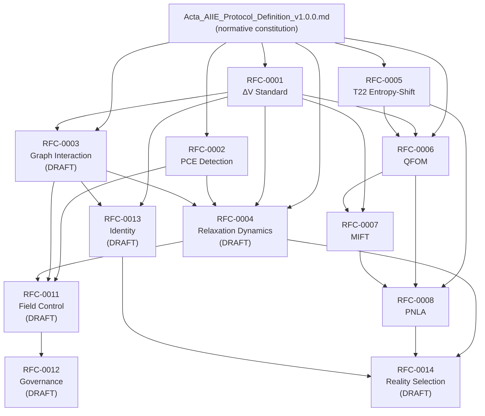

# Acta AIIE — RFC Series

**Normative base (all RFCs):** [`../Acta_AIIE_Protocol_Definition_v1.0.0.md`](../Acta_AIIE_Protocol_Definition_v1.0.0.md)

This directory publishes focused **Request for Comments** documents that refine, operationalize, or extend specific mechanisms of the Acta AIIE Protocol. Unless an RFC explicitly states otherwise, definitions in the v1.0.0 constitution prevail.

---

## Index

| ID | Title | Status | Language |
|----|--------|--------|----------|
| [RFC-0001](./RFC-0001-AIIE-Delta-Variance-Standard.md) | ΔV Standard Definition | **RATIFIED** | EN |
| [RFC-0002](./RFC-0002-AIIE-PCE-Detection-Protocol.md) | PCE Detection Protocol | **RATIFIED** | EN |
| [RFC-0003](./RFC-0003-AIIE-Narrative-Graph-Interaction-Model.md) | Narrative Graph Interaction Model | **DRAFT** | EN |
| [RFC-0004](./RFC-0004-AIIE-Narrative-Relaxation-Dynamics.md) | Narrative Relaxation Dynamics | **DRAFT** | EN |
| [RFC-0005](./RFC-0005-AIIE-T22-Entropy-Shift.md) | T22 Entropy-Shift ($H_0$) | **RATIFIED** | EN |
| [RFC-0006](./RFC-0006-AIIE-Quantum-Formalism-Observation-Model.md) | Quantum-Formalism Observation Model (QFOM) | **RATIFIED** | EN |
| [RFC-0007](./RFC-0007-AIIE-MIFT-Narrative-Information-Field-Theory.md) | MIFT — Magnetic Information Field Theory | **STABLE** | EN |
| [RFC-0008](./RFC-0008-AIIE-PNLA-Narrative-Least-Action.md) | PNLA — Principle of Narrative Least Action | **STABLE** | EN |
| [RFC-0011](./RFC-0011-AIIE-Narrative-Field-Control.md) | Narrative Field Control | **DRAFT** | EN |
| [RFC-0012](./RFC-0012-AIIE-Control-Governance-Layer.md) | Control Governance Layer | **DRAFT** | EN |
| [RFC-0013](./RFC-0013-AIIE-Narrative-Identity-Persistence.md) | Narrative Identity and Persistence | **DRAFT** | EN |
| [RFC-0014](./RFC-0014-AIIE-Narrative-Reality-Selection.md) | Narrative Reality Selection | **DRAFT** | EN |

*Note: RFC-0009 and RFC-0010 are reserved for future allocation.*

---

## Dependency graph

**Reading order (recommended):** BASE → R1 → R2 → R3 → R4 → R5 → R6 → R7 → R8 → R13 → R14 → R11 → R12

---

## Governance

- **RATIFIED** RFCs are stable for implementation; changes require a new RFC or protocol MINOR/PATCH per v1.0.0 §18.
- **STABLE** RFCs are complete and implementation-ready; may be ratified pending empirical validation.
- **DRAFT** RFCs are proposals; do not treat as compliance requirements until ratified.

---

*Acta AIIE Standardization Committee — Gemmina Intelligence LLC.*
