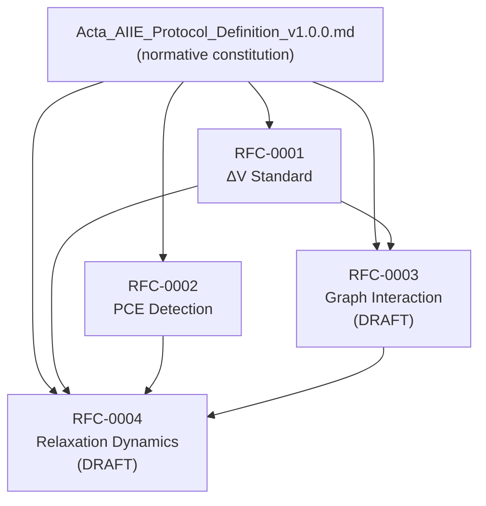

# Acta AIIE — RFC Series

**Normative base (all RFCs):** [`../Acta_AIIE_Protocol_Definition_v1.0.0.md`](../Acta_AIIE_Protocol_Definition_v1.0.0.md)

This directory publishes focused **Request for Comments** documents that refine, operationalize, or extend specific mechanisms of the Acta AIIE Protocol. Unless an RFC explicitly states otherwise, definitions in the v1.0.0 constitution prevail.

---

## Index

| ID | Title | Status | Language |
|----|--------|--------|----------|
| [RFC-0001](./RFC-0001-AIIE-Delta-Variance-Standard.md) | ΔV Standard Definition | **RATIFIED** | EN |
| [RFC-0002](./RFC-0002-AIIE-PCE-Detection-Protocol.md) | PCE Detection Protocol | **RATIFIED** | EN |
| [RFC-0003](./RFC-0003-AIIE-Narrative-Graph-Interaction-Model.md) | Narrative Graph Interaction Model | **DRAFT** | EN |
| [RFC-0004](./RFC-0004-AIIE-Narrative-Relaxation-Dynamics.md) | Narrative Relaxation Dynamics | **DRAFT** | EN |

---

## Dependency graph

RFCs build on the v1.0.0 definition and cross-reference each other where noted.

**Reading order (recommended):** BASE → RFC-0001 → RFC-0002 → RFC-0003 → RFC-0004.

---

## Governance

- **RATIFIED** RFCs are stable for implementation; changes require a new RFC revision or a protocol MINOR/PATCH per v1.0.0 §18.  
- **DRAFT** RFCs are proposals; do not treat as compliance requirements until ratified.

---

*Acta AIIE Standardization Committee — Gemmina Intelligence LLC.*
